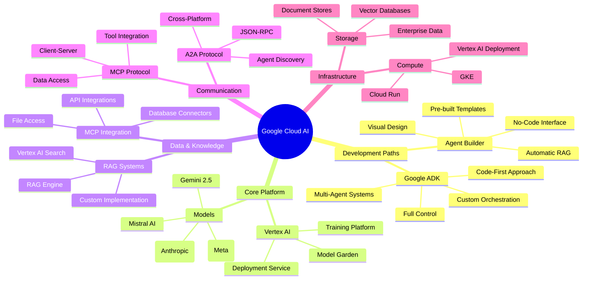

### Cloud AI

```mermaid
mindmap
  root((Google Cloud AI))
    Development Paths
      Agent Builder
        No-Code Interface
        Visual Design
        Pre-built Templates
        Automatic RAG
      Google ADK
        Code-First Approach
        Multi-Agent Systems
        Custom Orchestration
        Full Control
        
    Core Platform
      Vertex AI
        Model Garden
        Training Platform
        Deployment Service
      Models
        Gemini 2.5
        Claude (Anthropic)
        Llama (Meta)
        Mistral AI
        
    Data & Knowledge
      RAG Systems
        Vertex AI Search
        RAG Engine
        Custom Implementation
      MCP Integration
        Database Connectors
        API Integrations
        File Access
        
    Communication
      A2A Protocol
        Agent Discovery
        Cross-Platform
        JSON-RPC
      MCP Protocol
        Tool Integration
        Data Access
        Client-Server
        
    Infrastructure
      Compute
        Cloud Run
        GKE
        Vertex AI Deployment
      Storage
        Vector Databases
        Document Stores
        Enterprise Data
```