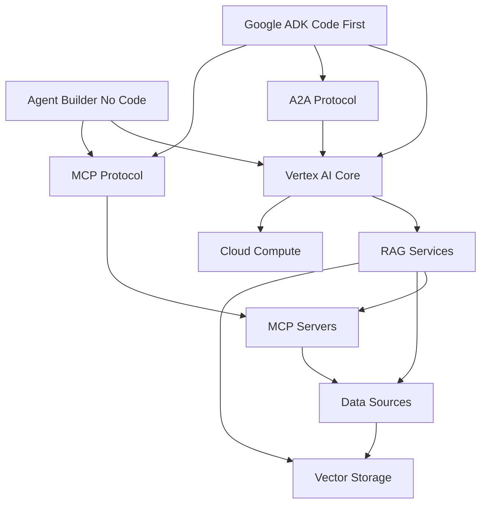
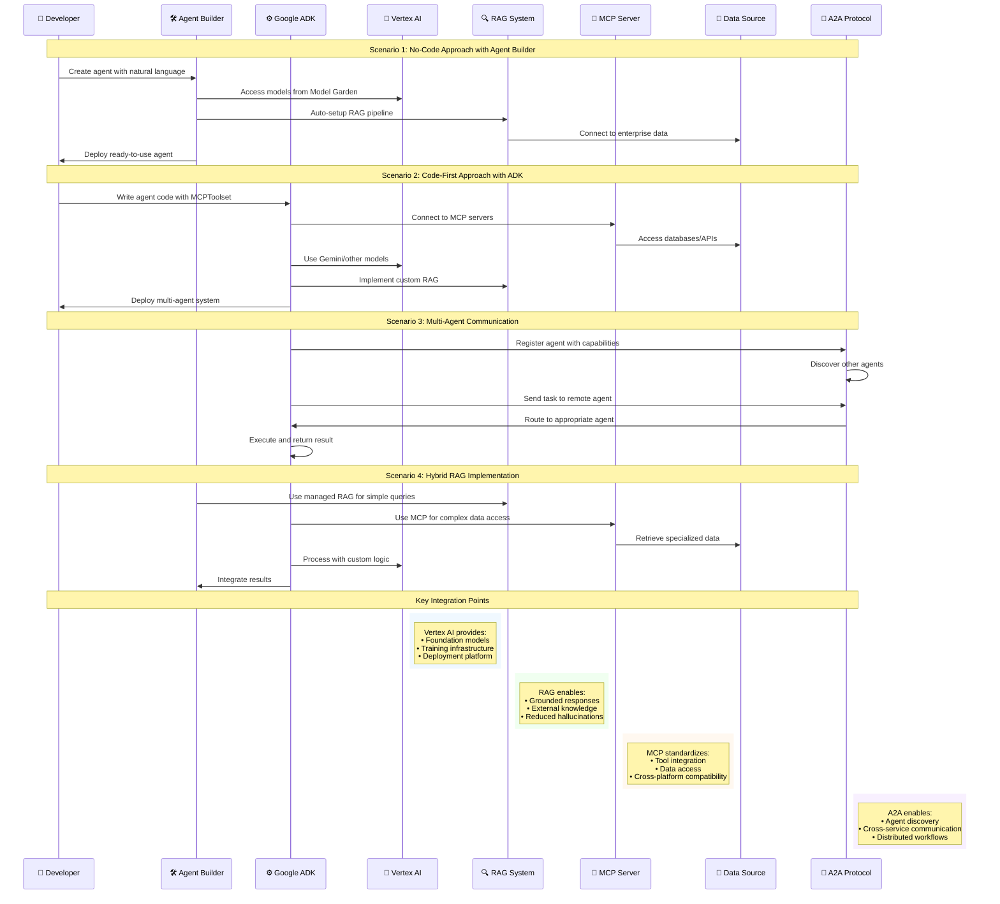

## GCP AI Services

### Simple Architecture

```mermaid
flowchart TD
    A1[Agent Builder No Code]
    A2[Google ADK Code First]
    
    C1[A2A Protocol]
    C2[MCP Protocol]
    
    P1[Vertex AI Core]
    P2[RAG Services]
    
    D1[MCP Servers]
    D2[Data Sources]
    
    I1[Cloud Compute]
    I2[Vector Storage]
    
    A1 --> P1
    A2 --> P1
    A2 --> C1
    A2 --> C2
    A1 --> C2
    
    C1 --> P1
    C2 --> D1
    
    P1 --> P2
    P2 --> D1
    P2 --> D2
    
    D1 --> D2
    
    P1 --> I1
    P2 --> I2
    D2 --> I2
```

#### Practical Work Flow

```mermaid
sequenceDiagram
    participant Dev as 👤 Developer
    participant AB as 🛠️ Agent Builder
    participant ADK as ⚙️ Google ADK
    participant VA as 💎 Vertex AI
    participant RAG as 🔍 RAG System
    participant MCP as 🔗 MCP Server
    participant Data as 💾 Data Source
    participant A2A as 📡 A2A Protocol
    
    Note over Dev, A2A: Scenario 1: No-Code Approach with Agent Builder
    
    Dev->>AB: Create agent with natural language
    AB->>VA: Access models from Model Garden
    AB->>RAG: Auto-setup RAG pipeline
    RAG->>Data: Connect to enterprise data
    AB->>Dev: Deploy ready-to-use agent
    
    Note over Dev, A2A: Scenario 2: Code-First Approach with ADK
    
    Dev->>ADK: Write agent code with MCPToolset
    ADK->>MCP: Connect to MCP servers
    MCP->>Data: Access databases/APIs
    ADK->>VA: Use Gemini/other models
    ADK->>RAG: Implement custom RAG
    ADK->>Dev: Deploy multi-agent system
    
    Note over Dev, A2A: Scenario 3: Multi-Agent Communication
    
    ADK->>A2A: Register agent with capabilities
    A2A->>A2A: Discover other agents
    ADK->>A2A: Send task to remote agent
    A2A->>ADK: Route to appropriate agent
    ADK->>ADK: Execute and return result
    
    Note over Dev, A2A: Scenario 4: Hybrid RAG Implementation
    
    AB->>RAG: Use managed RAG for simple queries
    ADK->>MCP: Use MCP for complex data access
    MCP->>Data: Retrieve specialized data
    ADK->>VA: Process with custom logic
    ADK->>AB: Integrate results
    
    Note over Dev, A2A: Key Integration Points
    
    rect rgb(240, 248, 255)
        Note right of VA: Vertex AI provides:<br/>• Foundation models<br/>• Training infrastructure<br/>• Deployment platform
    end
    
    rect rgb(240, 255, 240)
        Note right of RAG: RAG enables:<br/>• Grounded responses<br/>• External knowledge<br/>• Reduced hallucinations
    end
    
    rect rgb(255, 248, 240)
        Note right of MCP: MCP standardizes:<br/>• Tool integration<br/>• Data access<br/>• Cross-platform compatibility
    end
    
    rect rgb(248, 240, 255)
        Note right of A2A: A2A enables:<br/>• Agent discovery<br/>• Cross-service communication<br/>• Distributed workflows
    end
```