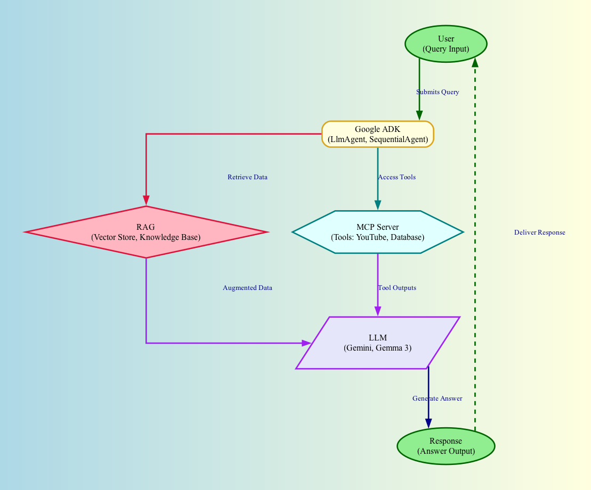

### AI

- [ADK LLM RAG MCP Overview](ADK_RAG_MCP_LLM_Overview.md)
- [RAG vs MC](RAG_vs_MCP.md)



- Components
  - AI Agent (Google ADK)
  - LLM
  - RAG
  - MCP Server (Tools)

```
+-----------------------------------+
|         User Interaction          |
|  (Query: "How to build an AI?")   |
+-----------------------------------+
                ↓
+-----------------------------------+
| Google ADK (Agent Orchestration)  |
|  - LlmAgent (Coordinator)         |
|  - SequentialAgent (Workflow)     |
|  - Tools (RAG, MCP Client)        |
+-----------------------------------+
    ↓                    ↓
    ↓ (Retrieve Data)    ↓ (Tool Access)
+--------------------+  +-------------------+
| RAG System         |  | MCP Server        |
|  - Vector Store    |  |  - Tools (e.g.,   |
|  - Knowledge Base  |  |    YouTube Search,|
|  - Semantic Search |  |    Database Query)|
+--------------------+  +-------------------+
    ↓                        ↓
+-----------------------------------+
| LLM (e.g., Gemini 2.0, Gemma 3)   |
|  - Reasoning & Response Generation|
|  - Processes Augmented Prompt     |
+-----------------------------------+
                ↓
+-----------------------------------+
|       Response to User            |
|  (Answer: "To build an AI...")    |
+-----------------------------------+
```

- [Store Data In RAG](Store_Data_In_RAG.md)
- [RAG On Google Cloud](RAG_On_GCP.md)